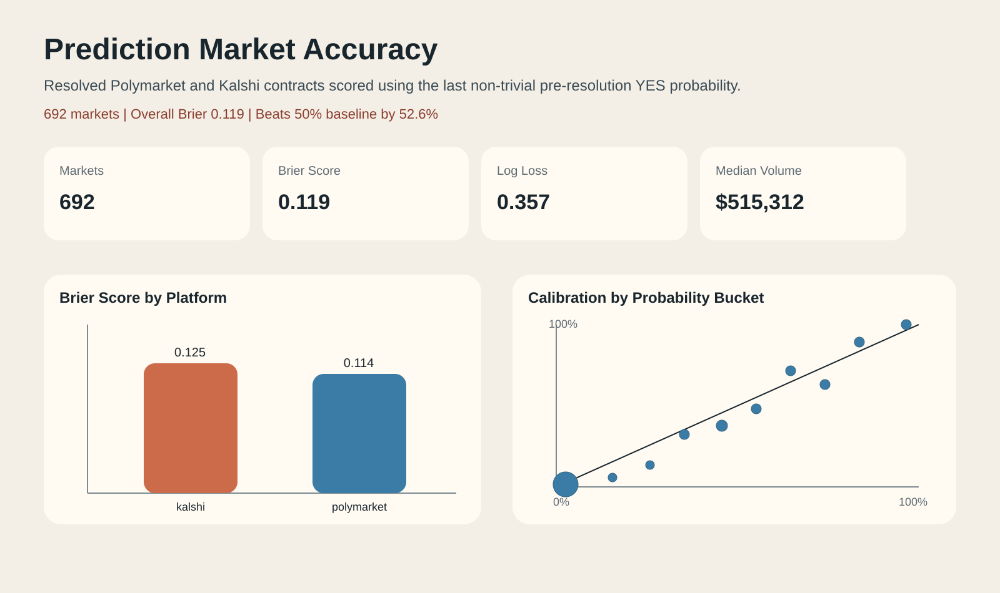

# Prediction Market Accuracy

This project evaluates how accurate liquid prediction markets are on Polymarket and Kalshi. The current pipeline expands beyond the original sports-and-elections MVP and uses a metadata-first category system so category labels can be audited instead of guessed from brittle title keywords alone.

The result is meant to read like an analyst case study, not just a data pull. It combines data collection, cleaning, forecast evaluation, category review tooling, a written notebook, and a Plotly/Dash dashboard.



## Why this project matters

Prediction markets are often described as information aggregators, but that claim becomes more interesting when it is evaluated against clear benchmarks. This project asks a concrete question:

How well did market-implied probabilities line up with what eventually happened?

That requires more than plotting prices. It means:

- defining comparable markets across platforms
- choosing a forecast definition that avoids trivial post-settlement prices
- evaluating against baselines instead of reporting a raw score without context
- checking calibration, uncertainty, and the relationship between market structure and forecast error

## Current dataset

The scored dataset lives in [data/cleaned/accuracy_markets.csv](data/cleaned/accuracy_markets.csv).

Each row now carries category provenance fields including:

- `raw_platform_category`
- `raw_tags`
- `category`
- `category_source`
- `category_confidence`
- `needs_review`
- `include_in_analysis`
- `is_cross_platform_comparable`

Current coverage:

- `906` scored markets total (`1,133` captured before scoring filters)
- `365` Polymarket markets
- `541` Kalshi markets

Current top-line summary:

- Overall Brier score: `0.1185`
- Overall log loss: `0.3547`
- Polymarket Brier score: `0.1127`
- Kalshi Brier score: `0.1223`

## Main findings

- The market forecasts beat an always-`50%` baseline by `53.0%` on Brier score overall, which turns the raw `0.1185` score into a meaningful evaluation result.
- The forecasts also beat an in-sample category base-rate benchmark by `46.9%` on Brier score overall, so the result is not just a side effect of many contracts resolving NO.
- In the raw sample, Polymarket has the lower average Brier score, but the bootstrap intervals overlap (Polymarket `0.098-0.128`, Kalshi `0.107-0.138`), so the platform comparison should be presented cautiously.
- A simple regression suggests that higher-volume markets and longer-duration markets are associated with lower Brier error, while the platform coefficient flips sign after controls. That is a useful reminder that raw platform rankings partly reflect market mix.
- Calibration is directionally reasonable, but many mid-probability buckets sit below the 45-degree line, which suggests some overestimation of YES probabilities away from the extremes.

## Methodology

Scope:

- resolved markets only
- binary YES/NO contracts only
- categories assigned via metadata-first taxonomy (sports, elections, politics, geopolitics, crypto, commodities, finance, etc.)
- minimum volume of `$100,000`
- categories with low confidence are flagged for review and excluded from scoring

Forecast definition:

- Polymarket: the last YES price from cached history that still shows meaningful uncertainty, defined as a probability between `0.02` and `0.98`
- Kalshi: prefer cached full history when available; otherwise use the best non-trivial snapshot probability preserved in the settled-market record

Metrics:

- Brier score
- Log loss
- Calibration by probability bucket
- Baseline comparisons against always-`50%` and in-sample category base-rate benchmarks
- Bootstrap `95%` confidence intervals for platform-level metrics
- A simple OLS regression of market-level Brier score on `log(volume)`, `days_to_resolution`, platform, and category

## Outputs

- Primary dashboard app: [app.py](app.py)
- Dash assets: [assets/app.css](assets/app.css)
- Static dashboard: [dashboard/index.html](dashboard/index.html)
- Notebook report: [notebooks/prediction_market_accuracy.ipynb](notebooks/prediction_market_accuracy.ipynb)
- Shared scoring helpers: [src/accuracy.py](src/accuracy.py)
- Category taxonomy: [config/category_taxonomy.yml](config/category_taxonomy.yml)
- Category overrides: [config/category_overrides.csv](config/category_overrides.csv)
- Category mapping logic: [src/category_mapping.py](src/category_mapping.py)
- Analysis export script: [src/analyze_accuracy.py](src/analyze_accuracy.py)
- Main scored dataset: [data/cleaned/accuracy_markets.csv](data/cleaned/accuracy_markets.csv)

## How to run

Create an environment and install dependencies:

```bash
python3 -m venv .venv
.venv/bin/pip install -r requirements.txt
```

Build or refresh the main dataset:

```bash
.venv/bin/python src/build_accuracy_dataset.py
```

Regenerate summary tables:

```bash
.venv/bin/python src/analyze_accuracy.py
```

This writes local summary CSVs into `data/cleaned/`, but those generated analysis tables are not committed to the repo.

Run the notebook:

```bash
.venv/bin/jupyter notebook notebooks/prediction_market_accuracy.ipynb
```

Run the primary Dash dashboard locally:

```bash
.venv/bin/python app.py
```

Then visit `http://127.0.0.1:8050`.

Open the static dashboard locally if you still want the older browser-only artifact:

```bash
python3 -m http.server 8765
```

Then visit [http://127.0.0.1:8765/dashboard/index.html](http://127.0.0.1:8765/dashboard/index.html).

## Limitations

- The current Kalshi slice is still methodologically weaker than the Polymarket slice because most Kalshi rows rely on snapshot fallback rather than full cached history.
- Kalshi category assignment is more inference-heavy than Polymarket because cached Kalshi payloads do not appear to expose the same rich tag metadata; low-confidence rows are flagged instead of silently trusted.
- Some markets have missing or incomplete timestamp fields, which creates an `unknown` lead-time bucket.
- The regression is associational, not causal. Higher volume correlating with lower error does not mean liquidity alone causes better forecasts.
- A Brier score around `0.12` is evidence that liquid markets contain real forecasting signal, but it is not evidence that they are perfectly efficient or easy to monetize.

## Tests

Scoring helpers are covered in [tests/test_accuracy.py](tests/test_accuracy.py).

Run the test suite with:

```bash
.venv/bin/python -m pytest
```

## What I'd do with more time

- Add a matched-sample platform comparison that restricts both platforms to the most methodologically comparable subset.
- Score earlier forecast snapshots such as `1 day` and `7 days` before resolution to test how much accuracy comes from last-minute convergence.
- Fetch fuller Kalshi history coverage so fewer rows depend on snapshot fallback.
- Compare these market-implied probabilities with external forecasters or aggregators such as Metaculus.

## What this project demonstrates

- API and raw-data ingestion
- data cleaning and schema harmonization across sources
- forecast evaluation with baselines and confidence intervals
- an interpretable modeling layer instead of pure descriptive analysis
- written communication through both a notebook and a dashboard
